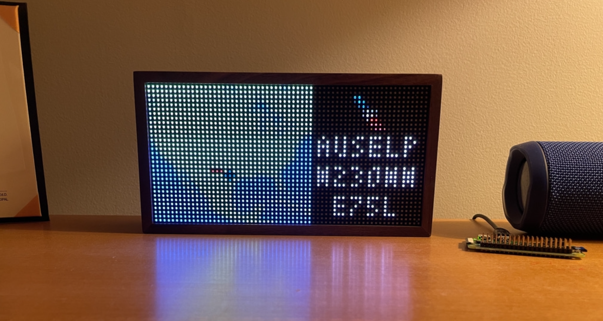

<h1>Tidbyt Aircraft History Tracker</h1>
<h3>Joshua Neronha, January 2021</h3>
 

  

    </img>
  

  

    </img>
  

<h2>Purpose</h2>

People who like flying too much (like me) often keep track of the tail numbers of the aircraft they fly on. But while I've recorded this data for a while now, I've never really known what to do with it. None of the flight tracking websites I use (PlaneFinder, FlightAware, etc.) allow you to see a map of current aircraft locations from a list of tail numbers. So when I received my <a href="https://tidbyt.com">Tidbyt</a> (a small, programmable 64 x 32 LED display), I set out to create a small application that would show me where all the aircraft I've previously flown currently are and what routes they are on. This project is based off my other project, the <a href="https://github.com/joshuaneronha/Tidbyt-Flight-Tracker">airport departure tracker</a>; it has different goals and uses different data but there are many shared elements like APIs and map generation.

<h2>Methodology</h2>

There are basically two main components to making this work. The first is actually getting the flight data, and the second is generating this data as an image and pushing it to the device. Because these processes need to run continuously and I have a laptop, I bought a Raspberry Pi Zero for $12, installed Linux, and set up both of these tasks as cron jobs that run every five minutes. Similarly, because the Tidbyt can only pull data from web sources, I set up a cheap web server to host the data I pull.

<h4>Getting the Data</h4>

I record my past flights using My FlightRadar24, which basically stores my flight history, tail numbers included, in an HTML page. Because I keep my flight history restricted and not publicly accessible, I periodically download the html file. Using a Python script (extract_flights.py), I parse the HTML file to get a list of tail numbers. Then, using the AirLabs API (which has fantastic data and is free for a limited number of calls per month), I pull the current location of the aircraft and its current route, which is returned as a json file.

<h4>Generating Images</h4>

This script generates two different types of images: the first, which is at left at the top of the page, shows the current location of all tail numbers, color-coded by airline. This was the original project, but I realized I'd like to know more than just the current location of all the aircraft I've been on! So I also set up a second visualization that randomly chooses three different flights each time using a random number generator and displays the airline, origin and destination, tail number, and aircraft model, along with a map of its route and current location. You'll eventually see the details of every aircraft currently in the air! I generate the maps in the Python script using the PIL module and upload them to my web server, along with all the other data shown in the second screen. Then, I render the data using .star scripts, which use Starlark, a dialect of Python used by the Tidbyt API. These scripts basically instruct the Tidbyt how it should display the pre-formatted data.

<h2>Results, Discussion, and Challenges</h2>

The Tidbyt flight tracker at work! The Raspberry Pi powering the setup can be seen to the right.

 

I'm very happy with how this project turned out! Now that it's setup, tracking my prior aircraft is extremely easy and requires no work but is always visible. The only maintenance, really, is periodically updating my flights from FlightRadar24 so the Tidbyt has the most up-to-date list of my aircraft history.

The main challenge was not the data gathering but rather figuring out how to best display the most information with very limited screen real estate (the Tidbyt is only 64 x 32 pixels!) However, after a lot of trial and error, I think everything came together nicely to produce a visually attractive and informative display of my aircraft history. I also got some experience working with some hardware compared to a solely software project, which was a great experience!

If you have a Tidbyt, I'd love to see you implement this fo your own flights! It should be pretty easy, as long as you have some computer or server constantly running and a basic knowledge of Python / Linux. Let me know how it goes!

<h2>Acknowledgments and Attribution</h2>

A special thanks to AirLabs, which upgraded my API quota after learning about this project! I release this project and all associated code into the public domain, and it may be used unrestricted as long as attribution is provided to this author and this project.
